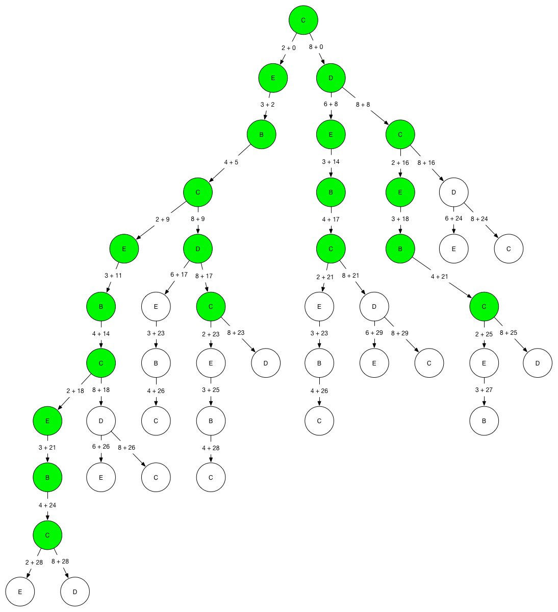

# Trains

## Deployment

### Local

If your local machine has Ruby 1.9.3 available, you can run `bundle install` to retrieve all required gems.

### Vagrant

#### Requirements

* [Vagrant](http://www.vagrantup.com/)
* [VirtualBox](https://www.virtualbox.org/)

#### Procedure

1. After installing Vagrant and VirtualBox, run `vagrant up` on the terminal from the project directory.
2. Once the box has been provisioned, run `vagrant ssh` on the terminal from the project directory.
3. You can run the application tests by running `rspec` from the virtual machine's `/vagrant` directory.

## Assumptions

### Input

* the application will be invoked programmatically; the input data text file is passed in to the `Application` class as a parameter
* the string `Graph: ` isn't included in the input file

### Change Management

* new queries might be requested by the local commuter railroad

## Design

I'm relatively inexperienced with Ruby as a programming language and have been using JavaScript (and some Clojure) much more extensively as of late. If I've made any grievous style mistakes, I apologize in advance. I chose Ruby because I admire the focus on expressiveness and readability. I wanted to implement some functional programming paradigms and they are relatively cumbersome to implement in Java (the language I have the most experience in of the three requested) and I'm not familiar at all with C# beyond a few introductory tutorials.

### Testing

I made use of RSpec and a BDD process to solve most of the tasks. I would create a specification and attempt to create the API I would like to satisfy the specification. Once the API was designed, I work work out to implementing the actual code to satisfy the desired API.

### Build

I'm using `Rake` to run the `RSpec` specifications. Not much more was required as the project was assumed to be used programmatically.

### DSL

I wanted to create a data-centric and functional DSL to implement the graph search algorithm. I borrowed from my beginner's experience in artificial intelligence to create a generalized graph search algorithm.

### Graph Data Structure

In the process of creating tests, I implemented a simple graph data structure to maintain neighbours and implemented a generalized graph search algorithm. The adjacency list seemed optimal for the required use, as neighbour lookup (read: set search) was O(1) in average case and O(n) in the worst case (if Ruby's hash algorithm avoids clustering this is unlikely to be reached). Since this was the primary operation used in the problem, this seems to be the best implementation (to my understanding).

Graph search is performed with the following parameters:

* `root`: The required root of the graph for the purposes of the query
* `select`: The selection criteria for a goal path. This query is satisfied when a trip that has been selected from the fringe is passed into the `select` `Proc` and `select` returns true. Functionality, `select` acts in a nature similar to the `Array#select` method (but on the current path selected from the fringe, instead of on an array instance). See `first` for details on how to select more than one path.
* `reject`: If an optional `reject` `Proc` is provided, the search allows cycles and will remove any paths from the fringe that do not satisfy `reject` constraints. Functionality, `reject` acts in a nature similar to the `Array#reject` method (but on the fringe, instead of on an array instance).
* `first`: If this parameter is defined, the search will return the first path found that satisfies `select` criteria. Otherwise, it will accumulate satisfactory paths until the fringe is empty.

I am using uniform cost search, a special case of the A* algorithm as the default search strategy. This is ideal for the problem since uniform cost search is:

* **Complete:** The strategy is proven to find a solution in a finite state space (with cycle protection or a fringe filter)
* **Optimal:** The strategy is proven to find the best solution based on cost

And since this is a special case of the A* search algorithm (with the trivial heuristic of 0), the strategy is:

* **Admissible:** The heuristic will "slow down" costly paths, but will not impede expanding paths with low actual costs.
* **Consistent:** The heuristic ensures optimality since each path is proven to be consistent. In other words, the relative cost of the heuristic is always lower than the actual path cost per edge.

### Distance

The distance function allows questions of distance to be answered with an intuitive input parameter: the route desired to be measured. The function itself reduces the provided route down to the associated distance, or returns `NO SUCH ROUTE` if, at any point in the reduction, the required neighbour cannot be found.

### Find All Trips

Delegates to `WeighedDirectedGraph#search`.

### Find Trip

Delegates to `WeightedDirectedGraph#search` with the `first` parameter defined.

## Visualizations

I had created a few visualizations to as an aid for me to understand the problem and have included them for convenience:

